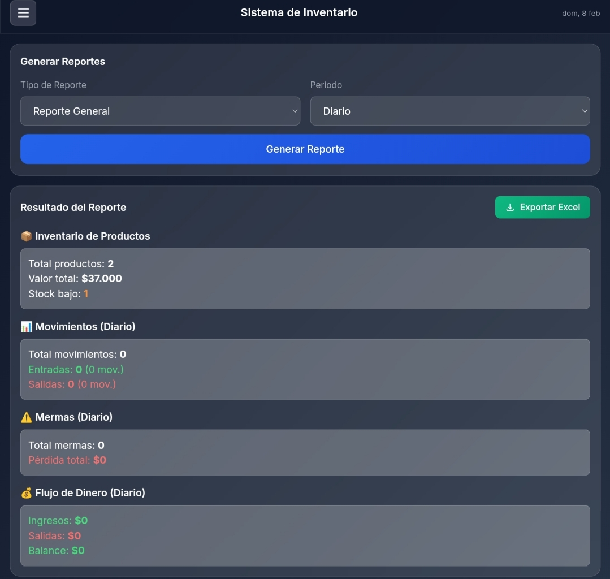

# 📱 ERP – Sistema de Inventario (Mobile First)

Este proyecto es un **Sistema de Inventario tipo ERP**, desarrollado como una **aplicación web Mobile First**, pensada para gestionar productos, movimientos, mermas y flujo de dinero desde un **dashboard principal centralizado**.

El sistema está orientado a la **gestión diaria del negocio**, con visualización clara de la información y persistencia de datos en la nube mediante **Firebase**.

---

## 🌐 Demo en vivo

Puedes ingresar al sistema como **visualizador / prueba** desde el siguiente enlace:

🔗 **https://crisdev-ch.github.io/ERP/webApp/index.html**

No requiere instalación, solo un navegador moderno.

---

## 🎯 Objetivo del proyecto

El objetivo principal de este ERP es:

- Centralizar la información del inventario
- Controlar entradas y salidas de productos
- Registrar mermas y pérdidas
- Visualizar ingresos, salidas y balance
- Generar reportes por período
- Facilitar la toma de decisiones desde un dashboard

Todo desde una aplicación web ligera, rápida y optimizada para dispositivos móviles.

---

## 📱 Enfoque Mobile First

El sistema fue diseñado siguiendo el enfoque **Mobile First**, lo que significa que:

- La interfaz está optimizada para pantallas pequeñas 📲
- Los controles están pensados para uso táctil
- El diseño es limpio, moderno y responsive
- Toda la información clave es visible sin saturar la pantalla
- Se adapta correctamente a tablets y escritorio

---

## 🧭 Generación de reportes

La **Generación de reportes** nos permite exportar y visualizar un resumen de nuestro sistema ERP, es un area principal que nos permite trabajar de manera rápida y eficaz.

### 📱 Vista Mobile – Reportes

  

Desde el dashboard se puede visualizar:

### 📦 Inventario
- Total de productos registrados
- Valor total del inventario
- Productos con stock bajo

### 🔄 Movimientos
- Entradas de productos
- Salidas de productos
- Total de movimientos por período

### ⚠️ Mermas
- Cantidad de mermas registradas
- Pérdidas económicas asociadas

### 💰 Flujo de Dinero
- Ingresos
- Salidas
- Balance general

Además, el sistema permite **filtrar la información por período** (diario, semanal o mensual) y **exportar los datos a Excel** directamente desde el dashboard.

---

## ☁️ Manejo de datos con Firebase

El proyecto utiliza **Firebase** como backend en la nube para:

- Almacenamiento de productos
- Registro de movimientos
- Control de mermas
- Persistencia de datos en tiempo real
- Acceso a la información desde cualquier dispositivo

Esto permite que los datos:
- No dependan del navegador
- Sean persistentes entre sesiones
- Simulen un ERP real conectado a un backend

---

## 🛠️ Tecnologías utilizadas

- **HTML** → estructura del sistema  
- **CSS** → diseño visual y responsive  
- **JavaScript (Vanilla)** → lógica del ERP y manejo de eventos  
- **Firebase** → persistencia de datos en la nube  

No se utilizan frameworks frontend, lo que permite un control completo del funcionamiento del sistema.
